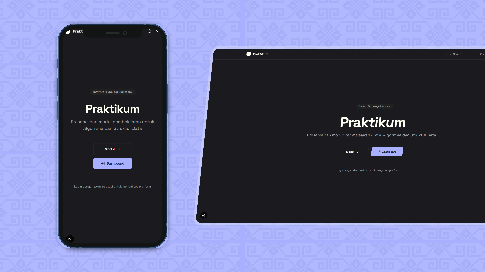

# Praktikum — Attendance & Learning Module Platform

**[Live Preview](https://praktikum-caseinn.vercel.app/)** | **[GitHub Repository](https://github.com/caseinn/praktikum)**

A secure, role-based academic platform for **Algoritma dan Struktur Data** practical sessions at **Institut Teknologi Sumatera (ITERA)**.  
Features real-time attendance with **geofenced check-in**, automated session management, and structured learning modules — all built with privacy and usability in mind.

> 🎓 **Role-aware** • **Geo-verified attendance** • **100% on-campus use**

---

## 🎯 Key Features

- **🔐 Role-Based Access**  
  - Students: View attendance history, check in via GPS during active sessions.  
  - Admins: Create sessions, manage bulk attendance, export CSV reports.
- **📍 Geofenced Check-in**  
  Uses precise GPS coordinates + radius validation to ensure physical presence.
- **🕒 Automatic Session Timing**  
  End time is **auto-set to 1 hour after start** (WIB timezone).
- **📊 Real-Time Attendance Dashboard**  
  Visual stats for students (attendance rate) and admins (session overview).
- **📚 Integrated Learning Modules**  
  MDX-powered documentation system for course materials.
- **📤 CSV Export**  
  One-click download of full attendance records for admins.
- **🛡️ Security**  
  - CSRF protection  
  - Rate limiting  
  - Google OAuth restricted to valid ITERA NIMs  
  - Redis-backed or in-memory nonce system for secure check-in

---

## 🛠️ Tech Stack

- **Framework**: Next.js
- **Auth**: NextAuth.js + Google OAuth + Prisma Adapter
- **Database**: MongoDB via Prisma ORM
- **Styling**: Tailwind CSS + [Fumadocs UI](https://fumadocs.dev/)
- **MDX Docs**: `fumadocs-core` for structured learning content
- **State & UI**: React, Lucide React, Sonner (toasts), TanStack Table
- **Infra**:  
  - Optional Redis (Upstash) for production rate-limiting & nonce storage  
  - Vercel deployment with edge-compatible middleware

---

## 📅 Attendance Workflow

### For Students:
1. Log in with **ITERA Google account** (e.g., `name.nim@itera.ac.id`).
2. On the dashboard, see upcoming/active/expired sessions.
3. During an **active session**, click **Check-in** → browser requests location → validates against session geo-fence.
4. On success: attendance marked as **HADIR** with timestamp and distance.

### For Admins:
1. Create a new session with:
   - Title
   - Start time (WIB)
   - Latitude/Longitude (auto-fetch via browser)
   - Radius (meters)
2. System auto-sets end time = start + 1 hour (WIB).
3. View live attendance table with filters, bulk actions (HADIR/IZIN/TIDAK_HADIR).
4. Export all records as CSV.

---

## 📦 Local Development

```bash
# 1. Clone repo
git clone https://github.com/caseinn/praktikum.git
cd praktikum

# 2. Install dependencies
npm install

# 3. Set up environment
cp .env.example .env.local
# Fill in:
# - DATABASE_URL
# - GOOGLE_CLIENT_ID & GOOGLE_CLIENT_SECRET
# - (Optional) UPSTASH_REDIS_REST_URL & UPSTASH_REDIS_REST_TOKEN

# 4. Set up DB
npx prisma generate
npx prisma migrate dev

# 5. Seed roster (add yourself!)
npx tsx prisma/seed.ts

# 6. Run dev server
npm run dev
```

> 💡 **Note**: The app assumes email format `{NIM}@itera.ac.id` to extract student ID.

---

## 📄 License

MIT License — for educational and institutional use.

> Created by **[Dito Rifki Irawan](https://instagram.com/ditorifkii)**  
> 📍 Institut Teknologi Sumatera (ITERA)

---

## ❤️ Support

If you find this project meaningful:
- ⭐ Star the repo
- 🔗 Follow [@ditorifkii on Instagram](https://instagram.com/ditorifkii) or explore more on [GitHub @caseinn](https://github.com/caseinn)

---
